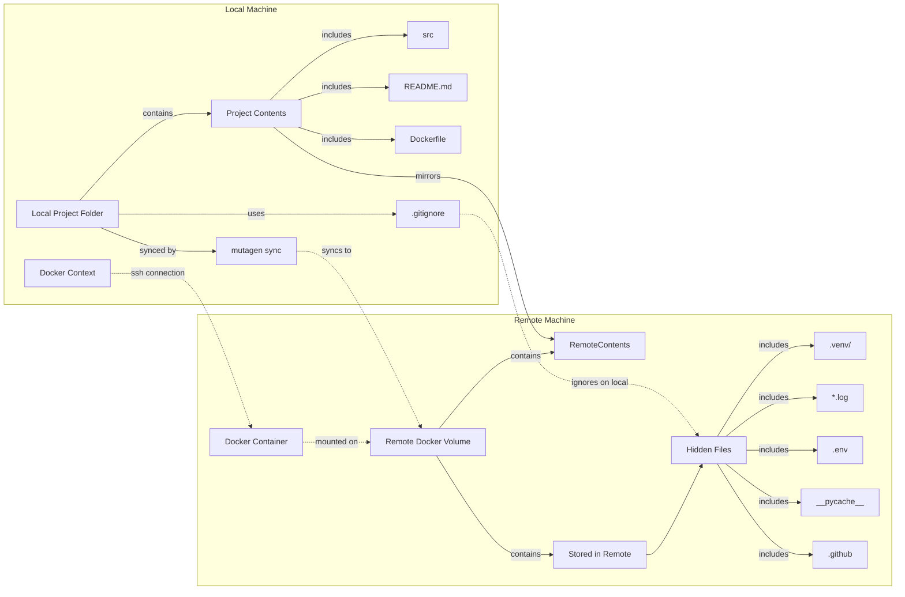
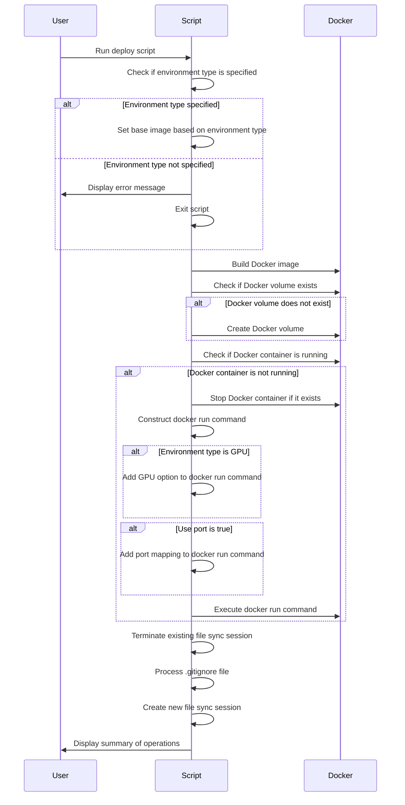

[](https://github.com/cvpaperchallenge/Ascender/actions/workflows/lint-and-test.yaml)
[](LICENSE)
[](https://github.com/psf/black)
[](https://github.com/PyCQA/flake8)
[](https://pycqa.github.io/isort/)
[](https://github.com/python/mypy)
[](https://zenodo.org/badge/latestdoi/466620310)

# PyDen (Python Docker Environment)
PyDen is a template created based on [Ascender](https://github.com/cvpaperchallenge/Ascender) that provides a streamlined setup for Python development environments using Docker and Mutagen file synchronization. It aims to simplify the process of setting up and managing development environments across local and remote machines.

## Features
- **Docker-based Environment**: PyDen leverages Docker to create isolated and reproducible development environments, ensuring consistency across different machines.
- **Mutagen File Synchronization**: It utilizes Mutagen to efficiently synchronize files between the local project folder and the remote development environment, keeping the codebase in sync.
- **GPU and CPU Support**: PyDen supports both GPU and CPU environments, allowing developers to choose the appropriate setup based on their project requirements.
- **Automated Deployment**: The provided deployment script automates the setup process, including building Docker images, managing volumes and containers, and establishing file synchronization.
- **Jupyter Notebook and Lab Integration**: PyDen enables running Jupyter Notebook and Jupyter Lab within the Docker container, facilitating interactive development and data exploration.

## Prerequisites
- Docker installed on both the local and remote machines.
- Docker context connection established from the local to the remote machine.
- Mutagen installed on the local machine.

## Getting Started
1. Clone the PyDen repository to your local machine.
2. Customize the `Dockerfile` and `.gitignore` file based on your project requirements.
3. Run the deployment script (`./environments/deploy.sh`) to set up the development environment.
4. Start developing your Python project, and the changes will be automatically synchronized between the local and remote environments.

## Running Jupyter Notebook and Lab
To run Jupyter Notebook or Jupyter Lab within the Docker container, use the following commands:

- Jupyter Notebook:
  ```
  poetry run jupyter notebook --port=<port num> --ip=0.0.0.0
  ```

- Jupyter Lab:
  ```
  poetry run jupyter lab --port=<port num> --ip=0.0.0.0
  ```

Replace `<port num>` with the desired port number.

## Overview of the Deployment Script (./environments/deploy.sh)

The deployment script automates the process of setting up and managing a development environment using Docker and Mutagen sync. It streamlines the workflow by building Docker images, creating and managing Docker volumes and containers, and synchronizing the local project folder with a remote machine.

### Key Features

1. **Environment Type Selection**:
   - The script allows the user to specify the environment type (GPU or CPU) to determine the appropriate base image for the Docker container.

2. **Docker Image Building**:
   - It builds a Docker image based on the specified environment type and the provided Dockerfile.

3. **Docker Volume Management**:
   - The script checks if the required Docker volume exists and creates it if necessary.
   - This volume is used to store the project files on the remote machine.

4. **Docker Container Management**:
   - It checks if the Docker container is running and starts it if needed.
   - The script constructs the `docker run` command based on the environment type and port usage settings.

5. **File Synchronization**:
   - The script uses Mutagen sync to synchronize the contents of the local project folder with the remote machine.
   - It terminates any existing file sync sessions and creates a new one, ensuring that the local and remote project files are in sync.

6. **.gitignore Processing**:
   - It processes the `.gitignore` file to identify the files and folders that should be ignored in the local project folder but still stored on the remote machine.

7. **Summary Display**:
   - Finally, the script displays a summary of the operations performed, providing an overview of the deployment process.

### Technologies Used

- **Docker**:
  - Used for containerization, allowing the development environment to be isolated and easily reproducible.

- **Mutagen sync**:
  - Employed for efficient file synchronization between the local project folder and the remote machine.

- **SSH (Secure Shell)**:
  - Utilized for secure communication between the local Docker context and the remote Docker container.

By using this deployment script, developers can streamline their workflow, ensure consistency between local and remote environments, and efficiently manage the deployment process. The script abstracts away the complexities of setting up and managing Docker containers and file synchronization, allowing developers to focus on writing code and building applications.





## Contributing
Contributions to PyDen are welcome! If you encounter any issues or have suggestions for improvements, please open an issue or submit a pull request on the GitHub repository.

## License
PyDen is released under the MIT License. See the [LICENSE](LICENSE) file for more details.

## Acknowledgements
PyDen is built upon the foundation of Ascender and leverages various open-source tools and libraries. We extend our gratitude to the developers and maintainers of these projects.
