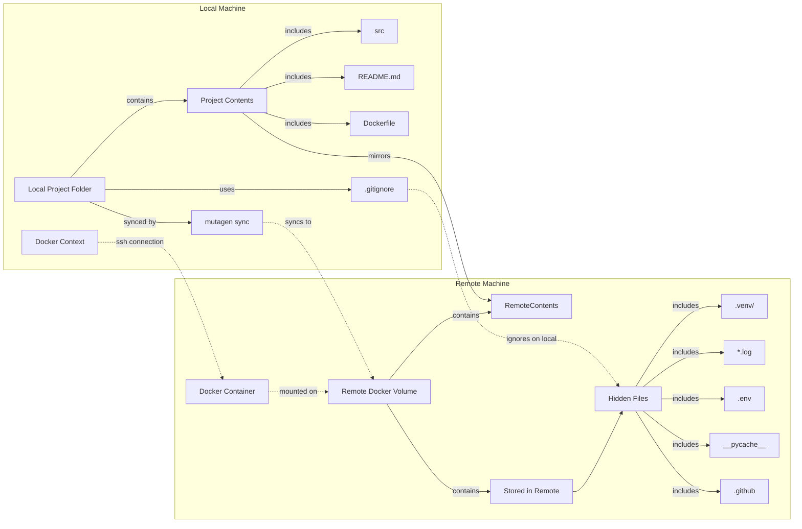

# PythonDockerEnvTemplate
This template is created based on Ascender. \

Basic usage is written in [Ascender](https://github.com/cvpaperchallenge/Ascender) .
This repository adds a feature to Ascender that uses Mutagen to synchronize files between local and remote development environments.

## Prerequisite
- Installed docker in both the local environment and the remote one.
- Constructed connection with docker context from local to remote.
- Installed mutagen.

## Overview ./environments/deploy.sh
The graph illustrates a development workflow that involves synchronizing a local project folder with a remote machine using Mutagen sync. The local project folder contains the source code, README, Dockerfile, and a .gitignore file. The .gitignore file specifies files and folders that should be ignored locally but are still stored on the remote machine. The local machine also has a Docker context that establishes an SSH connection with the remote Docker container. On the remote machine, there is a Docker volume that contains the remote contents, which mirror the local project folder, as well as additional files and folders stored exclusively on the remote machine.

Technologies used:
- Mutagen sync: A tool used for synchronizing the contents of the local project folder with the remote machine.
- Docker: A platform for developing, shipping, and running applications using containers. The graph shows the usage of Docker containers and volumes.
- SSH (Secure Shell): A network protocol used for secure communication between the local Docker context and the remote Docker container.

